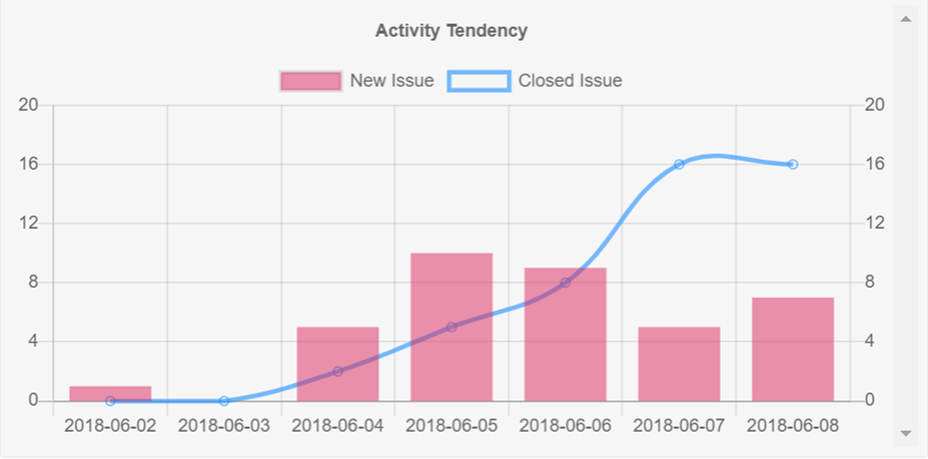

# Redmine Activity Monitor

This plugin is designed to assist in monitoring latest activities on Redmine.

## Installation
### Requirements

* Redmine

### Plugin setup

* Copy or clone the app into your Redmine plugin folder.    
* Restart Redmine application.

## Usage
Access to your project overview on Redmine. A graph which shows the latest trends will be displayed on the lower right of the page.

  
### Analyzing point of view:
* How many issues are created
* How many issues are closed

